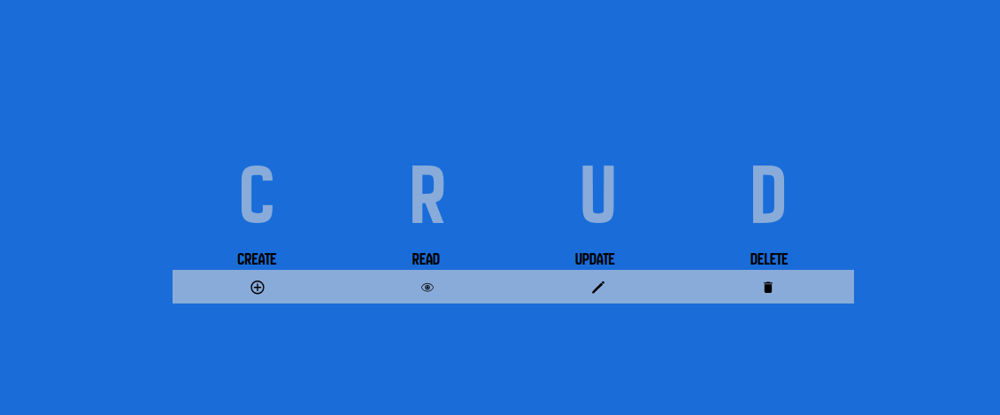

# CRUD

This project aims to create a CRUD with creation, reading, updating and deleting functionalities. To implement this project, React, Node.js and MySQL technologies were used.



### Creating files for the project:
```bash
npx create-react-app my_crud 
cd my_crud
```

### The backend folder (javascript) was created and the extensions were installed:
```bash
mkdir backend
cd backend 
npm init -y 
npm install express mysql cors react-icons axios
```
### Prisma (ORM):
```bash
npm install @prisma/cli --save-dev
npm install @prisma/client
npx prisma init
npx prisma migrate dev --name init
npx prisma generate
```

### To run the project:

- To run Frontend:
```bash
npm start
```
- To run the Backend: 
```bash
cd backend
node server.js
```


